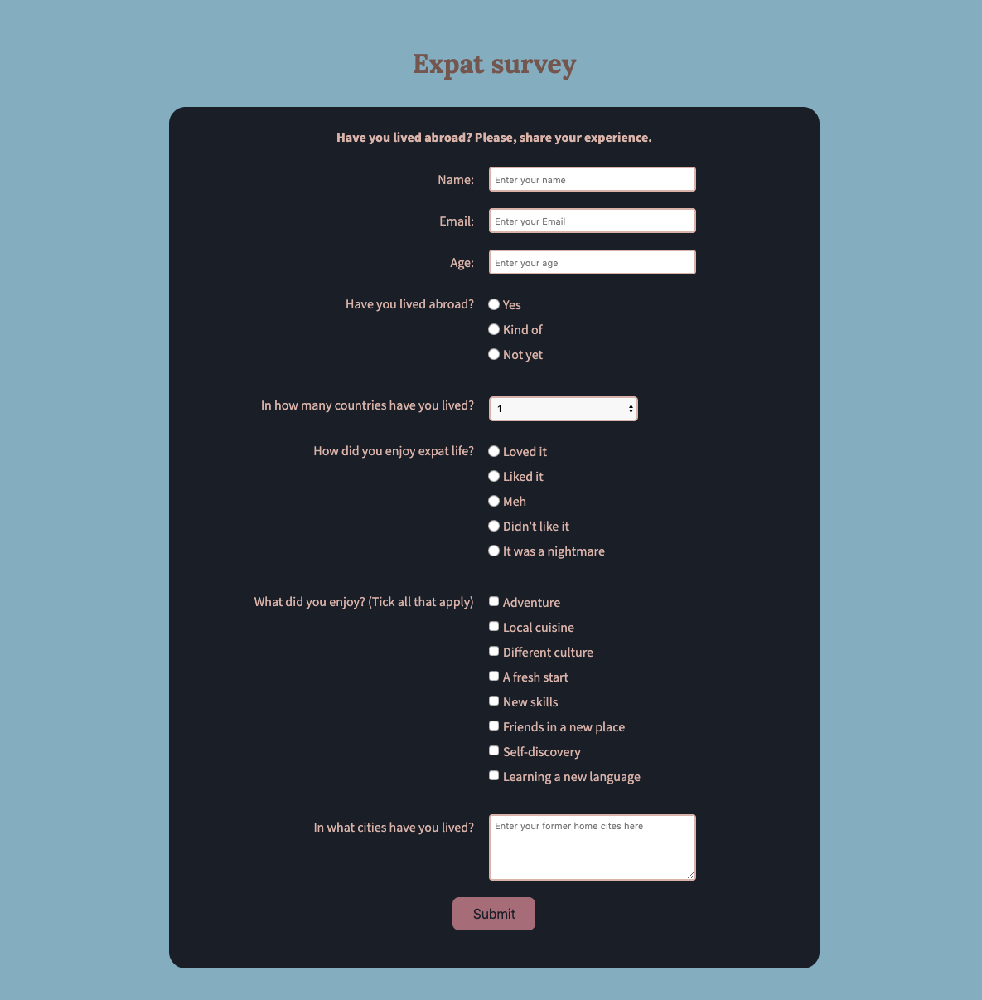

# Survey Form about expat life
This is my other web development project. I built this survey form with front-end web development technologies. This project demonstrates the principles of responsive web design. I wrote a blog post about the way I created the project, you can find it on my [medium profile](https://medium.com/@marko.libor/expat-survey-9e1fa22189b6).

## What I learned
* Basic HTML
* Basic CSS
* Applied Visual Design
* Responsive Web Design Principles

## Technologies used
* HTML5
* CSS3

## Setup and Run
1. Download the project files
2. Extract all files from the zipped folder
3. Open the folder
4. Open the file called "index.html"

## Screenshot of the webpage

